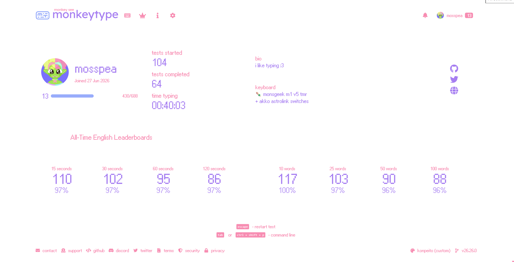
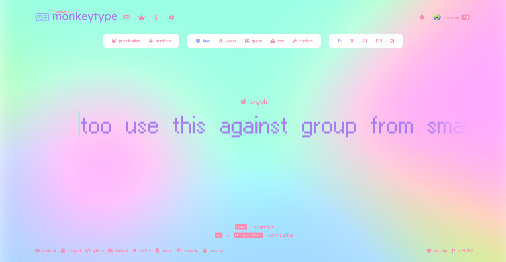

# _konpeitō_ • a custom theme for monkeytype

 

I decided to share my multicolored theme inspired by konpeitō, the star-shaped sugar candy traditionally enjoyed in Japan.

Feel free to reach out if you have any questions, or if you have trouble successfully implementing konpeitō. 
Additonally, don't hesitate to edit this theme to your liking. You can use it as the foundation for another custom theme.

## Thank you! / Recommended resources:
  • [Ari-W9500 Font](https://www.1001freefonts.com/ari-w9500.font) 
  • [image_01](image_01.png) was created with [better-gradient.com](https://better-gradient.com/editor) 

## How to install:

### Method A = direct external link:
  simply click one of the following links to directly install konpeitō. 
     • [version 0](https://monkeytype.com?customTheme=eyJjIjpbIiNmZmZmZmYiLCIjOThhY2ZiIiwiIzZmZWNiYyIsIiNmNzhkYjIiLCIjZmZmZmZmIiwiI2E2N2VmMSIsIiM2ZmVjYmMiLCIjNzVmNmZmIiwiIzZmZWNiYyIsIiM3NWY2ZmYiXX0=) = no background image 
     • other versions will be available soon 

### Method B = entirely manual:
  1.) create your own custom theme 
  2.) implement the custom theme colors and/or custom background filters one by one 

#### Color Codes:
  background = #ffffff 
  main = #98acfb 
  sub = #f78db2 
  text = #a67ef1 
  caret = #6fecbc 
  sub alt = #ffffff 
  error = #6fecbc 
  extra error = #75f6ff 

**When Colorful Mode is Enabled:**  
  error = #6fecbc 
  extra error = #75f6ff 

#### Background Filter Values:
  blur = 1.9 
  brightness = 1.1 
  saturate = 1.4 
  opacity = 0.8 

### Method C = export/import .json:
1.) export your monkeytype settings 
2.) replace the necessary parts with [my custom data](konpeit%C5%8D_Method_C.json) (you don't have to replace the customBackground data if you're using your own image, or no background image) 
3.) lastly, save and import your revised .json file 
